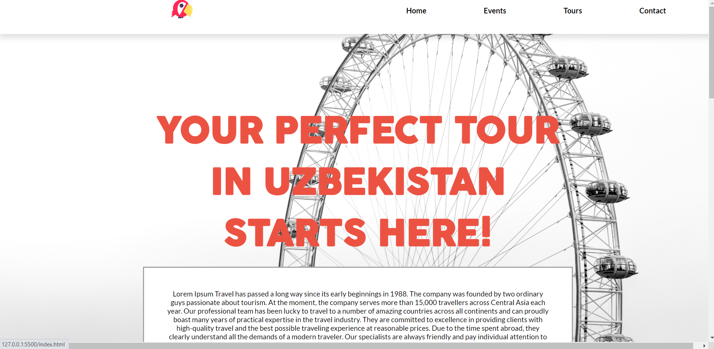

# Capstone: setup and mobile version skeleton
Static tourism website where you can see information like price of tours.

## Built With

- HTML
- CSS
- JavaScript
- Git&Github
- Visual Studio Code

## Live Demo

[Live Demo Link](https://tourism-website-laylo309.netlify.app/)

## Getting Started

### Install

To get a local copy up and running follow these simple example steps.

- Open terminal
- Clone this project by the command `https://github.com/Laylo309/first_capstone.git`
- `Cd first_capstone` folder
- Open `index.html` in your local browser or using Live Server in Visual Studio Code.
- To install this project run `npm install`.
- To run the project use the command `npm start`

## Authors

👤 **Laylo**

- GitHub: [Laylo309](https://github.com/Laylo309)
- Twitter: [laylo_khodjaeva](https://twitter.com/laylo_khodjaeva)
- LinkedIn: [laylo_khodjaeva](https://www.linkedin.com/in/laylo-khodjaeva/)

## 🤝 Contributing

Contributions, issues, and feature requests are welcome!

Feel free to check the [issues page](../../issues/).

## Show your support

Give a ⭐️ if you like this project!

## Acknowledgments

- Cindy Shin

## 📝 License

This project is [MIT](./MIT.md) licensed.
